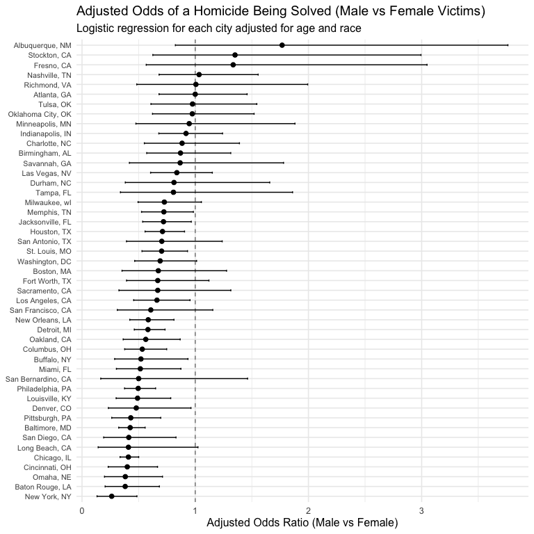
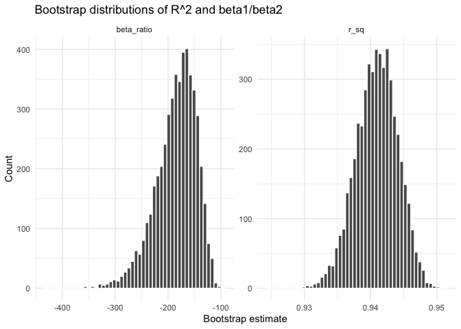
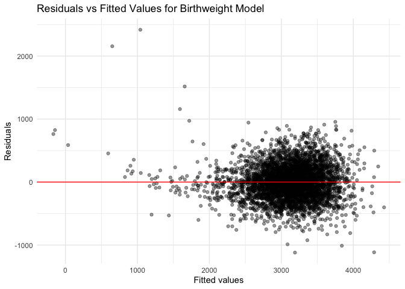

Homework 6
================
Jake Vettoretti
2025-11-29

``` r
library(broom)
library(modelr)
```

    ## 
    ## Attaching package: 'modelr'

    ## The following object is masked from 'package:broom':
    ## 
    ##     bootstrap

``` r
library(tidyverse)
```

    ## ── Attaching core tidyverse packages ──────────────────────── tidyverse 2.0.0 ──
    ## ✔ dplyr     1.1.4     ✔ readr     2.1.5
    ## ✔ forcats   1.0.0     ✔ stringr   1.5.1
    ## ✔ ggplot2   3.5.2     ✔ tibble    3.3.0
    ## ✔ lubridate 1.9.4     ✔ tidyr     1.3.1
    ## ✔ purrr     1.1.0

    ## ── Conflicts ────────────────────────────────────────── tidyverse_conflicts() ──
    ## ✖ modelr::bootstrap() masks broom::bootstrap()
    ## ✖ dplyr::filter()     masks stats::filter()
    ## ✖ dplyr::lag()        masks stats::lag()
    ## ℹ Use the conflicted package (<http://conflicted.r-lib.org/>) to force all conflicts to become errors

``` r
library(forcats)
library(p8105.datasets)
set.seed(1)
```

## Problem 1

``` r
## Loading the data

homicides <- read_csv("https://raw.githubusercontent.com/washingtonpost/data-homicides/master/homicide-data.csv")
```

    ## Rows: 52179 Columns: 12
    ## ── Column specification ────────────────────────────────────────────────────────
    ## Delimiter: ","
    ## chr (9): uid, victim_last, victim_first, victim_race, victim_age, victim_sex...
    ## dbl (3): reported_date, lat, lon
    ## 
    ## ℹ Use `spec()` to retrieve the full column specification for this data.
    ## ℹ Specify the column types or set `show_col_types = FALSE` to quiet this message.

# Starting to clean and summarize

``` r
homicides_clean =
  homicides |>
    mutate(
      city_state = str_c(city, ", ", state),
      solved = if_else(disposition == "Closed by arrest", 1, 0),
      victim_age = as.numeric(victim_age)
      ) |>
    filter(
      !(city_state %in% c("Dallas, TX", "Phoenix, AZ", "Kansas City, MO", "Tulsa, AL")),
      victim_race %in% c("White", "Black")
      )
```

    ## Warning: There was 1 warning in `mutate()`.
    ## ℹ In argument: `victim_age = as.numeric(victim_age)`.
    ## Caused by warning:
    ## ! NAs introduced by coercion

# GLM for Baltimore

``` r
# Filter to Baltimore
baltimore_data =
  homicides_clean |>
  filter(city_state == "Baltimore, MD")

# Fit logistic regression
baltimore_glm =
  glm(
    solved ~ victim_age + victim_sex + victim_race,
    data = baltimore_data,
    family = binomial
  )

# Tidy and extract adjusted OR for male vs female
baltimore_results =
  broom::tidy(
    baltimore_glm,
    exponentiate = TRUE,
    conf.int = TRUE
  ) |>
  filter(term == "victim_sexMale") |>
  select(term, estimate, conf.low, conf.high)

baltimore_results
```

    ## # A tibble: 1 × 4
    ##   term           estimate conf.low conf.high
    ##   <chr>             <dbl>    <dbl>     <dbl>
    ## 1 victim_sexMale    0.426    0.324     0.558

# GLM for each city

``` r
city_glm_results =
  homicides_clean |>
  group_by(city_state) |>
  nest() |>
  mutate(
    fit = map(
      data,
      ~ glm(
        solved ~ victim_age + victim_sex + victim_race,
        data = .x,
        family = binomial
      )
    ),
    tidy_fit = map(
      fit,
      ~ broom::tidy(
        .x,
        exponentiate = TRUE,
        conf.int = TRUE
      )
    )
  ) |>
  unnest(tidy_fit) |>
  filter(term == "victim_sexMale") |>
  select(city_state, term, estimate, conf.low, conf.high)
```

    ## Warning: There were 43 warnings in `mutate()`.
    ## The first warning was:
    ## ℹ In argument: `tidy_fit = map(fit, ~broom::tidy(.x, exponentiate = TRUE,
    ##   conf.int = TRUE))`.
    ## ℹ In group 1: `city_state = "Albuquerque, NM"`.
    ## Caused by warning:
    ## ! glm.fit: fitted probabilities numerically 0 or 1 occurred
    ## ℹ Run `dplyr::last_dplyr_warnings()` to see the 42 remaining warnings.

``` r
city_glm_results
```

    ## # A tibble: 47 × 5
    ## # Groups:   city_state [47]
    ##    city_state      term           estimate conf.low conf.high
    ##    <chr>           <chr>             <dbl>    <dbl>     <dbl>
    ##  1 Albuquerque, NM victim_sexMale    1.77     0.825     3.76 
    ##  2 Atlanta, GA     victim_sexMale    1.00     0.680     1.46 
    ##  3 Baltimore, MD   victim_sexMale    0.426    0.324     0.558
    ##  4 Baton Rouge, LA victim_sexMale    0.381    0.204     0.684
    ##  5 Birmingham, AL  victim_sexMale    0.870    0.571     1.31 
    ##  6 Boston, MA      victim_sexMale    0.674    0.353     1.28 
    ##  7 Buffalo, NY     victim_sexMale    0.521    0.288     0.936
    ##  8 Charlotte, NC   victim_sexMale    0.884    0.551     1.39 
    ##  9 Chicago, IL     victim_sexMale    0.410    0.336     0.501
    ## 10 Cincinnati, OH  victim_sexMale    0.400    0.231     0.667
    ## # ℹ 37 more rows

# Plot that shows the estimated ORs and CIs for each city

``` r
city_glm_results |>
  ggplot(aes(
    x = estimate,
    y = fct_reorder(city_state, estimate)
  )) +
  geom_vline(xintercept = 1, linetype = "dashed", color = "gray50") +
  geom_point(size = 2) +
  geom_errorbar(aes(xmin = conf.low, xmax = conf.high), width = 0.2) +
  labs(
    title = "Adjusted Odds of a Homicide Being Solved (Male vs Female Victims)",
    subtitle = "Logistic regression for each city adjusted for age and race",
    x = "Adjusted Odds Ratio (Male vs Female)",
    y = NULL
  ) +
  theme_minimal(base_size = 12) +
  theme(
    axis.text.y = element_text(size = 8)
  )
```

<!-- -->

Comments: Most cities show adjusted odds ratios close to one, which
means that after accounting for age and race the chance that a homicide
is solved is similar for male and female victims. A few cities have odds
ratios above one, suggesting higher odds of a solved case among male
victims, while others fall below one, suggesting higher odds among
female victims. Many cities also have wide confidence intervals, which
indicates substantial uncertainty and likely smaller sample sizes.
Overall, there is no clear or consistent pattern across cities, and most
results suggest little difference in solve rates by victim sex once
demographic factors are considered.

## Problem 2

# Bootstrap setup

``` r
data("weather_df")

weather_clean =
  weather_df |>
  drop_na(tmax, tmin, prcp)

boot_results =
  weather_clean |>
  bootstrap(5000) |>
  mutate(
    fit   = map(strap, ~ lm(tmax ~ tmin + prcp, data = .x)),
    gl    = map(fit, glance),
    td    = map(fit, tidy),
    r_sq  = map_dbl(gl, "r.squared"),
    beta_ratio = map_dbl(
      td,
      ~ {
        b1 = .x |> filter(term == "tmin") |> pull(estimate)
        b2 = .x |> filter(term == "prcp") |> pull(estimate)
        b1 / b2
      }
    )
  ) |>
  select(r_sq, beta_ratio)
```

# Plot bootstrap

``` r
boot_results |>
  pivot_longer(
    cols = c(r_sq, beta_ratio),
    names_to = "parameter",
    values_to = "estimate"
  ) |>
  ggplot(aes(x = estimate)) +
  geom_histogram(bins = 50, color = "white") +
  facet_wrap(~ parameter, scales = "free", nrow = 1) +
  labs(
    x = "Bootstrap estimate",
    y = "Count",
    title = "Bootstrap distributions of R^2 and beta1/beta2"
  ) +
  theme_minimal()
```

<!-- -->

# 95% CI from bootstrap

``` r
boot_results |>
  summarise(
    r2_low     = quantile(r_sq, 0.025),
    r2_high    = quantile(r_sq, 0.975),
    ratio_low  = quantile(beta_ratio, 0.025),
    ratio_high = quantile(beta_ratio, 0.975)
  )
```

    ## # A tibble: 1 × 4
    ##   r2_low r2_high ratio_low ratio_high
    ##    <dbl>   <dbl>     <dbl>      <dbl>
    ## 1  0.934   0.947     -275.      -125.

Comments: The bootstrap distribution of (R^2) is tightly concentrated
around 0.94, indicating that the linear model with tmin and prcp
explains a consistent and high proportion of the variability in tmax
across resamples. The 95 percent bootstrap interval for (R^2) (0.934 to
0.947) reflects this stability.

In contrast, the distribution of the ratio (\_1 / \_2) is much wider and
strongly skewed. This reflects high uncertainty in the relative
magnitudes of the effects of tmin and prcp. The 95 percent interval
(−275 to −125) is very broad, showing that even though the ratio is
consistently negative (because the estimated slope for precipitation is
small and negative), its exact value is highly variable from sample to
sample.

Overall, the bootstrap suggests that the overall model fit (R²) is very
stable, while the ratio of coefficients is much more sensitive to
sampling variation.

## Problem 3

# Part 1

``` r
birthweight =
  read_csv("birthweight.csv") |>
  janitor::clean_names() |>
  mutate(
    babysex = factor(babysex, levels = c(1, 2), labels = c("male", "female")),
    frace   = factor(frace, levels = c(1,2,3,4,8,9),
                     labels = c("white","black","asian","puerto_rican","other","unknown")),
    mrace   = factor(mrace, levels = c(1,2,3,4,8),
                     labels = c("white","black","asian","puerto_rican","other")),
    malform = factor(malform, levels = c(0,1), labels = c("absent","present")),
    # parity is usually treated as numeric integer
    parity  = as.integer(parity)
  )
```

    ## Rows: 4342 Columns: 20
    ## ── Column specification ────────────────────────────────────────────────────────
    ## Delimiter: ","
    ## dbl (20): babysex, bhead, blength, bwt, delwt, fincome, frace, gaweeks, malf...
    ## 
    ## ℹ Use `spec()` to retrieve the full column specification for this data.
    ## ℹ Specify the column types or set `show_col_types = FALSE` to quiet this message.

``` r
#Check missing data
birthweight_missing =
  birthweight |>
  summarize(across(everything(), ~ sum(is.na(.))))

birthweight_missing
```

    ## # A tibble: 1 × 20
    ##   babysex bhead blength   bwt delwt fincome frace gaweeks malform menarche
    ##     <int> <int>   <int> <int> <int>   <int> <int>   <int>   <int>    <int>
    ## 1       0     0       0     0     0       0     0       0       0        0
    ## # ℹ 10 more variables: mheight <int>, momage <int>, mrace <int>, parity <int>,
    ## #   pnumlbw <int>, pnumsga <int>, ppbmi <int>, ppwt <int>, smoken <int>,
    ## #   wtgain <int>

# Part 2

``` r
#Model

birthweight_model =
  birthweight |>
  lm(bwt ~ bhead + blength + gaweeks + ppbmi + smoken + babysex + mrace, data = _)

summary(birthweight_model)
```

    ## 
    ## Call:
    ## lm(formula = bwt ~ bhead + blength + gaweeks + ppbmi + smoken + 
    ##     babysex + mrace, data = birthweight)
    ## 
    ## Residuals:
    ##      Min       1Q   Median       3Q      Max 
    ## -1119.31  -186.22    -7.94   176.28  2418.20 
    ## 
    ## Coefficients:
    ##                    Estimate Std. Error t value Pr(>|t|)    
    ## (Intercept)       -5859.947    101.731 -57.603  < 2e-16 ***
    ## bhead               135.151      3.497  38.650  < 2e-16 ***
    ## blength              78.442      2.035  38.554  < 2e-16 ***
    ## gaweeks              12.328      1.481   8.323  < 2e-16 ***
    ## ppbmi                 5.171      1.341   3.857 0.000116 ***
    ## smoken               -4.302      0.595  -7.230 5.69e-13 ***
    ## babysexfemale        31.311      8.610   3.637 0.000279 ***
    ## mraceblack         -141.600      9.378 -15.099  < 2e-16 ***
    ## mraceasian         -103.215     43.042  -2.398 0.016527 *  
    ## mracepuerto_rican  -139.896     18.988  -7.368 2.07e-13 ***
    ## ---
    ## Signif. codes:  0 '***' 0.001 '**' 0.01 '*' 0.05 '.' 0.1 ' ' 1
    ## 
    ## Residual standard error: 277.7 on 4332 degrees of freedom
    ## Multiple R-squared:  0.7067, Adjusted R-squared:  0.706 
    ## F-statistic:  1159 on 9 and 4332 DF,  p-value: < 2.2e-16

Model equation: bwt =−5859.947+135.151(bhead) + 78.442(blength) +
12.328(gaweeks) + 5.171(ppbmi) − 4.302(smoken) + 31.311(babysex =
female) − 141.600(mrace = black) − 103.215(mrace = asian) −
139.896(mrace = puerto_rican) − 141.600(mrace = black) −103.215(mrace =
asian) − 139.896(mrace = puerto_rican)

Description of modeling process: To model birthweight, I selected
predictors based on biological plausibility and prior knowledge of
factors that influence fetal growth. Head circumference, birth length,
and gestational age are direct indicators of newborn size and maturity.
Maternal pre-pregnancy BMI reflects nutritional status, and smoking
during pregnancy is a well-established risk factor for reduced
birthweight. I included baby sex and maternal race as demographic
covariates that may influence birth outcomes. This approach balances
scientific justification with interpretability.

``` r
#Residual vs fitted plot

birthweight_residplot =
  birthweight |>
  add_predictions(birthweight_model) |>
  add_residuals(birthweight_model) |>
  ggplot(aes(x = pred, y = resid)) +
  geom_point(alpha = 0.4) +
  geom_hline(yintercept = 0, color = "red") +
  labs(
    x = "Fitted values",
    y = "Residuals",
    title = "Residuals vs Fitted Values for Birthweight Model"
  ) +
  theme_minimal()

birthweight_residplot
```

<!-- -->

# Part 3

``` r
#Cross validated model comparison

  # My model
model_main =
  lm(bwt ~ bhead + blength + gaweeks + ppbmi + smoken + babysex + mrace,
     data = birthweight)

  # Model A: length + gestational age, main effects only
model_simple =
  lm(bwt ~ blength + gaweeks, data = birthweight)

  # Model B: all interactions among head circumference, length, sex
model_interaction =
  lm(bwt ~ bhead * blength * babysex, data = birthweight)

#Cross validation using MCV
cv_df =
  crossv_mc(birthweight, 50) |>
  mutate(
    train = map(train, as_tibble),
    test  = map(test, as_tibble)
  )

#Fit all three models on training set
cv_results =
  cv_df |>
  mutate(
    fit_main = map(train,
                   ~ lm(bwt ~ bhead + blength + gaweeks + ppbmi +
                          smoken + babysex + mrace, data = .x)),
    fit_simple = map(train,
                     ~ lm(bwt ~ blength + gaweeks, data = .x)),
    fit_interaction = map(train,
                          ~ lm(bwt ~ bhead * blength * babysex, data = .x))
  )

#Compute RMSE
cv_results =
  cv_results |>
  mutate(
    rmse_main =
      map2_dbl(fit_main, test,
               ~ rmse(model = .x, data = .y)),

    rmse_simple =
      map2_dbl(fit_simple, test,
               ~ rmse(model = .x, data = .y)),

    rmse_interaction =
      map2_dbl(fit_interaction, test,
               ~ rmse(model = .x, data = .y))
  )

#Summarizing predicted error
cv_summary =
  cv_results |>
  summarise(
    main_rmse  = mean(rmse_main),
    simple_rmse = mean(rmse_simple),
    interaction_rmse = mean(rmse_interaction)
  )

cv_summary
```

    ## # A tibble: 1 × 3
    ##   main_rmse simple_rmse interaction_rmse
    ##       <dbl>       <dbl>            <dbl>
    ## 1      278.        333.             289.

Write up:

To compare the predictive performance of the three candidate models, I
performed a 50-fold Monte Carlo cross-validation and computed the root
mean squared error (RMSE) on each test set. The average RMSE values
were:

Main-effects model: 278.18

Simple model (length and gestational age): 332.68

Full interaction model: 289.11

The main-effects model had the lowest RMSE, indicating the best
predictive accuracy of the three. This suggests that including
biologically relevant predictors such as head circumference, birth
length, gestational age, maternal BMI, smoking, sex, and maternal race
provides meaningful information for predicting birthweight.

The simple model had the highest RMSE, meaning that using only birth
length and gestational age results in noticeably worse predictions. This
is expected because birthweight is influenced by many maternal and
infant characteristics beyond size and gestational age.

The interaction model performed better than the simple model but worse
than the main-effects model. Adding all two-way and three-way
interactions among head circumference, length, and sex increased the
complexity without improving predictive accuracy, likely due to
overfitting.

In summary, the main-effects model shows the best balance of model
complexity and predictive performance for estimating birthweight in this
dataset.
